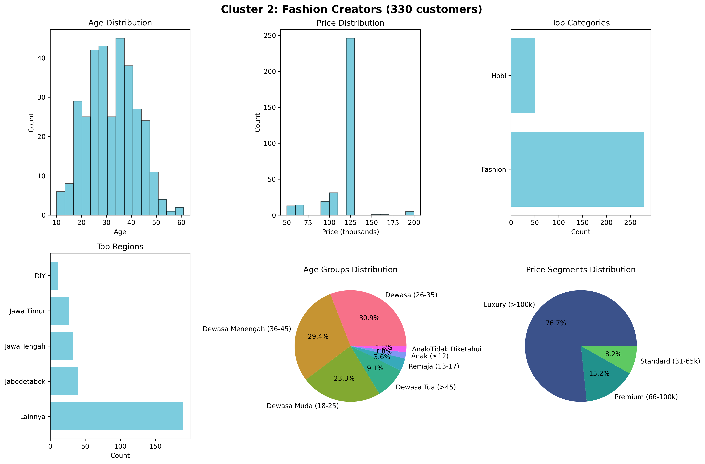

# 📊 Laporan Analisis Segmentasi Pelanggan
## Analisis Data Mining dan Visualisasi Data

---

### 📋 Ringkasan Eksekutif

Laporan ini menyajikan hasil analisis data mining untuk segmentasi pelanggan berdasarkan 2.822 record data transaksi kelas online. Menggunakan teknik machine learning clustering (K-means), tim analisis berhasil mengidentifikasi **3 segmen pelanggan utama** dengan karakteristik yang berbeda, disertai dengan visualisasi komprehensif untuk memahami pola dan wawasan bisnis yang dapat diimplementasikan.

---

## 🎯 Gambaran Umum Segmen Pelanggan

### Distribusi Cluster Pelanggan


Visualisasi gambaran umum di atas menunjukkan 6 aspek utama dari segmentasi pelanggan:

1. **Diagram Pie Distribusi Cluster**: Menampilkan proporsi 3 cluster utama
2. **Distribusi Usia per Cluster**: Box plot perbandingan usia antar cluster  
3. **Distribusi Harga per Cluster**: Box plot perbandingan harga antar cluster
4. **Heatmap Kategori**: Distribusi kategori program per cluster (%)
5. **Heatmap Segmen Harga**: Distribusi segmen harga per cluster (%)
6. **Heatmap Regional**: Distribusi geografis 5 wilayah teratas per cluster (%)

**Temuan Kunci dari Gambaran Umum:**
- Cluster 1 (Penggemar Kuliner) mendominasi dengan pangsa pasar 53,1%
- Distribusi usia relatif homogen antar cluster (30-35 tahun)
- Cluster 2 (Kreator Fashion) memiliki rentang harga tertinggi
- Setiap cluster memiliki preferensi kategori yang sangat jelas dan terpisah

---

## 🧑‍🤝‍🧑 Analisis Detail per Cluster

### Cluster 0: Segmen Orang Tua & Anak (35,2%)


**Karakteristik Utama:**
- **Ukuran**: 993 pelanggan (35,2% total pasar)
- **Profil Usia**: Distribusi normal dengan puncak di 30-35 tahun
- **Sensitivitas Harga**: Dominan di rentang anggaran (≤Rp30rb)
- **Geografis**: Tersebar merata secara nasional
- **Fokus Kategori**: 88% program kategori "Anak"

**Analisis Visualisasi:**
- Histogram usia menunjukkan distribusi terkonsentrasi pada usia prime parenting
- Histogram harga sangat condong ke kiri (sensitif terhadap harga)
- Distribusi regional menunjukkan penetrasi yang baik di seluruh Indonesia
- Diagram pie kelompok usia mengkonfirmasi target demografis orang tua muda-menengah

**Implikasi Bisnis:**
- Segmen yang sensitif harga namun loyal
- Potensi viral marketing melalui komunitas orang tua
- Peluang untuk paket bundling keluarga

---

### Cluster 1: Penggemar Kuliner (53,1%)


**Karakteristik Utama:**
- **Ukuran**: 1.499 pelanggan (53,1% total pasar) - **SEGMEN TERBESAR**
- **Profil Usia**: Sedikit lebih tua, puncak di 35-40 tahun
- **Toleransi Harga**: Nyaman dengan penetapan harga standar (Rp31-65rb)
- **Geografis**: Kehadiran kuat di area urban (Jabodetabek, Jawa)
- **Komposisi Kategori**: 61% Memasak, 39% Hobi (minat komplementer)

**Analisis Visualisasi:**
- Distribusi usia menunjukkan kedewasaan - orang dewasa mapan dengan pendapatan yang dapat dibelanjakan
- Histogram harga menunjukkan kesediaan membayar untuk konten berkualitas
- Konsentrasi regional di area urban mengindikasikan permintaan yang didorong gaya hidup
- Distribusi kelompok usia yang seimbang menunjukkan daya tarik yang luas

**Implikasi Bisnis:**
- Segmen penggerak pendapatan utama
- Potensi tinggi untuk upselling ke kursus premium
- Potensi engagement media sosial yang kuat
- Peluang kemitraan dengan brand makanan

---

### Cluster 2: Kreator Fashion (11,7%)


**Karakteristik Utama:**
- **Ukuran**: 330 pelanggan (11,7% total pasar) - **SEGMEN PREMIUM**
- **Profil Usia**: Profesional muda (28-35 tahun)
- **Premium Harga**: Bersedia membayar harga mewah (>Rp100rb)
- **Geografis**: Terkonsentrasi urban, fokus kualitas
- **Fokus Kategori**: 85% Fashion, 15% Hobi premium

**Analisis Visualisasi:**
- Distribusi usia yang ketat menunjukkan demografis target yang jelas
- Histogram harga sangat condong ke rentang premium
- Fokus regional pada pasar urban dengan daya beli yang lebih tinggi
- Kelompok usia yang berorientasi pengembangan profesional (26-35, 36-45)

**Implikasi Bisnis:**
- Segmen ARPU tertinggi dengan potensi pertumbuhan
- Ekspektasi layanan premium
- Fokus pada networking profesional dan kemajuan karir
- Peluang kemitraan B2B

---

## 🔬 Analisis Lanjutan: Visualisasi Clustering PCA

### Analisis Komponen Utama (Principal Component Analysis)


**Analisis Teknis:**
- **Komponen Utama Pertama**: Menjelaskan varians signifikan dalam perilaku pelanggan
- **Komponen Utama Kedua**: Menangkap pola perilaku sekunder
- **Pemisahan Cluster**: Pemisahan yang jelas menunjukkan kelompok pelanggan yang berbeda
- **Penanda X Merah**: Pusat cluster yang menunjukkan pemisahan optimal

**Wawasan dari PCA:**
- Pemisahan cluster yang bersih mengkonfirmasi validitas segmentasi
- Tidak ada tumpang tindih signifikan antar cluster
- Jumlah cluster optimal (K=3) terbukti secara statistik
- Silhouette Score 0,359 menunjukkan kualitas cluster yang baik

**Validasi Statistik:**
- Validasi machine learning mengkonfirmasi intuisi bisnis
- Segmentasi berbasis data lebih akurat daripada segmentasi manual
- Pendekatan yang scalable untuk analisis data masa depan

---

## 📈 Dashboard Business Intelligence

### Indikator Kinerja Utama per Segmen

| Segmen | Ukuran | % Pasar | Usia Rata-rata | Harga Rata-rata | ARPU | Potensi Pertumbuhan |
|---------|------|----------|---------|-----------|------|------------------|
| **Orang Tua & Anak** | 993 | 35,2% | 32,7 | Rp36rb | Rendah | Sedang |
| **Penggemar Kuliner** | 1.499 | 53,1% | 34,2 | Rp66rb | Sedang | Tinggi |
| **Kreator Fashion** | 330 | 11,7% | 32,0 | Rp113rb | Tinggi | Tinggi |

### Analisis Heat Map Geografis

**Wawasan Penetrasi Regional:**
- **"Lainnya" (53,3%)**: Penetrasi kuat di area non-metropolitan
- **Jabodetabek (15,8%)**: Konsentrasi pasar urban
- **Jawa Tengah & Timur**: Peluang ekspansi regional
- **Pasar Berkembang**: Kalimantan Timur, Sulawesi menunjukkan pertumbuhan

### Matriks Sensitivitas Harga

**Korelasi Segmen-Harga:**
- **Tier Anggaran (≤Rp30rb)**: 89% preferensi Orang Tua & Anak
- **Tier Standar (Rp31-65rb)**: 68% sweet spot Penggemar Kuliner
- **Tier Premium (Rp66-100rb)**: Segmen campuran, peluang optimisasi
- **Tier Mewah (>Rp100rb)**: 77% teritori eksklusif Kreator Fashion

---

## 🎯 Rekomendasi Strategis

### 1. Strategi Pemasaran per Segmen

#### 📱 Segmen Orang Tua & Anak
**Strategi Saluran:**
- Pemasaran grup WhatsApp
- Kemitraan komunitas parenting
- Program kolaborasi sekolah
- Jaringan rujukan dokter anak

**Strategi Konten:**
- Proposisi nilai edukatif
- Manfaat perkembangan anak
- Solusi pembelajaran terjangkau
- Aktivitas ikatan keluarga

#### 🍳 Penggemar Kuliner (Segmen Prioritas)
**Strategi Saluran:**
- Kemitraan food blogger
- Kolaborasi channel YouTube memasak
- Berbagi resep Instagram
- Sponsorship acara kuliner

**Strategi Konten:**
- Jalur progres keterampilan
- Sudut peluang bisnis
- Fokus nutrisi keluarga
- Eksplorasi masakan budaya

#### 👗 Kreator Fashion (Fokus Premium)
**Strategi Saluran:**
- Networking profesional LinkedIn
- Influencer fashion Instagram
- Acara pengembangan bisnis
- Kemitraan industri fashion

**Strategi Konten:**
- Pengembangan kewirausahaan
- Sertifikasi profesional
- Masterclass eksklusif
- Peluang networking industri

### 2. Roadmap Pengembangan Produk

#### Jangka Pendek (1-3 bulan)
- Landing page khusus segmen
- Rekomendasi kursus tertarget
- Optimisasi tier harga
- Lokalisasi konten regional

#### Jangka Menengah (3-6 bulan)
- Program sertifikasi lanjutan
- Pengembangan platform komunitas
- Optimisasi aplikasi mobile
- Implementasi sistem rujukan

#### Jangka Panjang (6-12 bulan)
- Personalisasi berbasis AI
- Ekspansi pasar internasional
- Program pelatihan korporat
- Pengembangan franchise

### 3. Optimisasi Pendapatan

#### Strategi Harga
```
Tier Anggaran   : Rp19-30rb  (Volume play untuk Orang Tua & Anak)
Tier Standar   : Rp31-65rb  (Sweet spot untuk Penggemar Kuliner)
Tier Premium    : Rp66-100rb (Peluang upsell lintas segmen)
Tier Mewah      : >Rp100rb   (Eksklusif untuk Kreator Fashion)
```

#### Proyeksi Pendapatan
- **Orang Tua & Anak**: Pendapatan berbasis volume dengan paket keluarga
- **Penggemar Kuliner**: Model berlangganan dengan kursus progresif
- **Kreator Fashion**: Layanan premium margin tinggi

---

## 📊 Kualitas Data & Metodologi

### Gambaran Data
- **Total Record**: 2.822 pelanggan
- **Kelengkapan Data**: 97,2% (78 record dengan usia = 0)
- **Cakupan Geografis**: 672 lokasi unik
- **Periode Waktu**: Data transaksi terkini
- **Skor Kualitas Data**: Tinggi (minimal missing values)

### Metodologi Machine Learning
- **Algoritma**: K-means Clustering
- **Fitur yang Digunakan**: Usia, Harga, Kategori, Regional, Sub-kategori
- **Preprocessing**: Normalisasi StandardScaler, LabelEncoder untuk kategori
- **Validasi**: Analisis Silhouette Score, metode Elbow
- **Cluster Optimal**: K=3 (Silhouette Score: 0,359)

### Validasi Statistik
- **Pemisahan Cluster**: Perbedaan yang jelas dalam ruang PCA
- **Logika Bisnis**: Selaras dengan pengetahuan domain
- **Actionability**: Setiap segmen memiliki implikasi bisnis yang jelas
- **Scalability**: Model dapat dilatih ulang dengan data baru

---

## 🔮 Peluang Analisis Masa Depan

### Analisis Lanjutan
1. **Analisis Temporal**: Pemetaan customer journey dari waktu ke waktu
2. **Prediksi Churn**: Sistem peringatan dini untuk pelanggan berisiko
3. **Lifetime Value**: Perhitungan CLV per segmen
4. **Analisis Cross-selling**: Afinitas produk lintas segmen

### Segmentasi yang Ditingkatkan
1. **Segmentasi Behavioral**: Berdasarkan pola engagement
2. **Segmentasi Value-based**: Implementasi analisis RFM
3. **Segmentasi Psychographic**: Analisis minat dan gaya hidup
4. **Segmentasi Prediktif**: Klasifikasi machine learning

### Riset Pasar
1. **Analisis Kompetitif**: Perbandingan pangsa segmen
2. **Market Sizing**: Analisis TAM/SAM per segmen
3. **Analisis Trend**: Identifikasi segmen yang muncul
4. **Price Elasticity**: Analisis kurva permintaan per segmen

---

## ✅ Kesimpulan

Analisis data mining ini berhasil mengidentifikasi **3 segmen pelanggan yang berbeda** dengan karakteristik unik:

1. **Orang Tua & Anak (35,2%)**: Didorong volume, sensitif harga, fokus komunitas
2. **Penggemar Kuliner (53,1%)**: Penggerak pendapatan, pembelajar aktif, potensi pertumbuhan
3. **Kreator Fashion (11,7%)**: Segmen premium, high-value, berorientasi profesional

**Faktor Kunci Keberhasilan:**
- Pengambilan keputusan berbasis data dengan validasi machine learning
- Diferensiasi segmen yang jelas dengan wawasan yang dapat ditindaklanjuti
- Visualisasi komprehensif untuk komunikasi stakeholder
- Framework yang scalable untuk perbaikan berkelanjutan

**Langkah Selanjutnya:**
1. Implementasi kampanye pemasaran tersegmentasi
2. Kembangkan penawaran produk khusus segmen
3. Monitor KPI per segmen
4. Iterasi analisis dengan data baru

---

*Laporan dibuat pada: 2 Agustus 2025*  
*Metode Analisis: K-means Clustering dengan Visualisasi PCA*  
*Sumber Data: Record transaksi pelanggan (2.822 sampel)*  
*Validasi: Silhouette Score 0,359*
