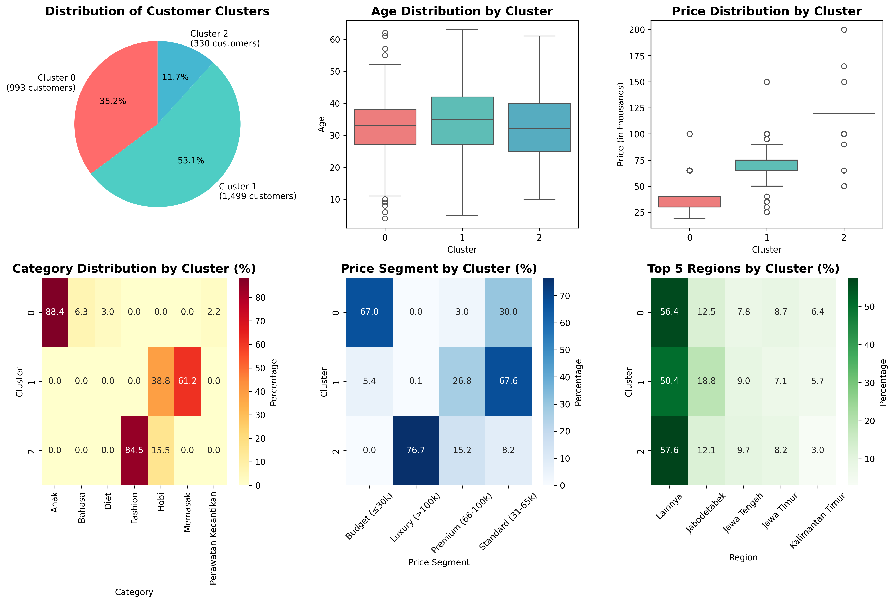
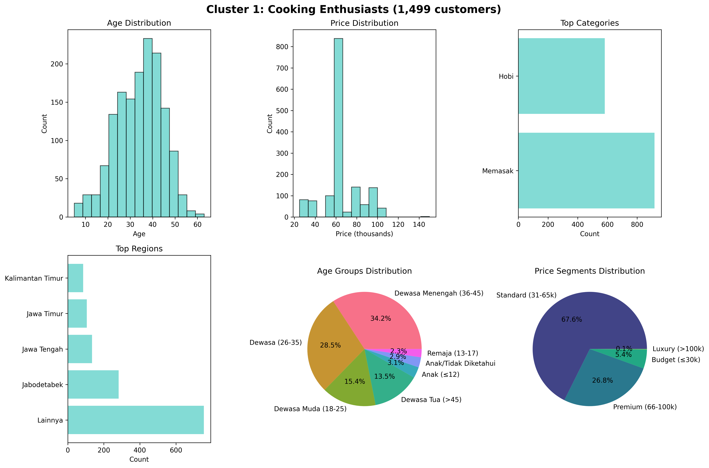
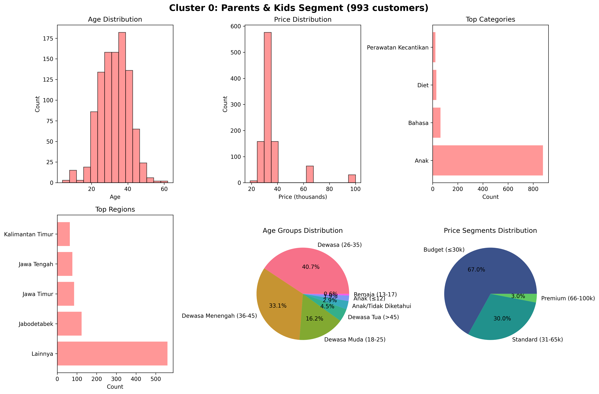
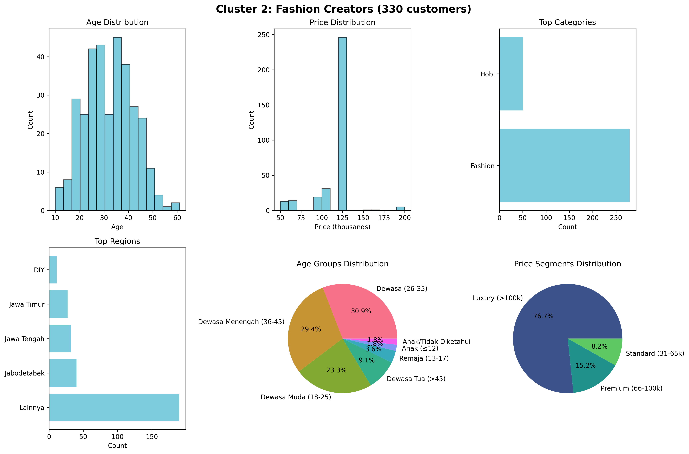
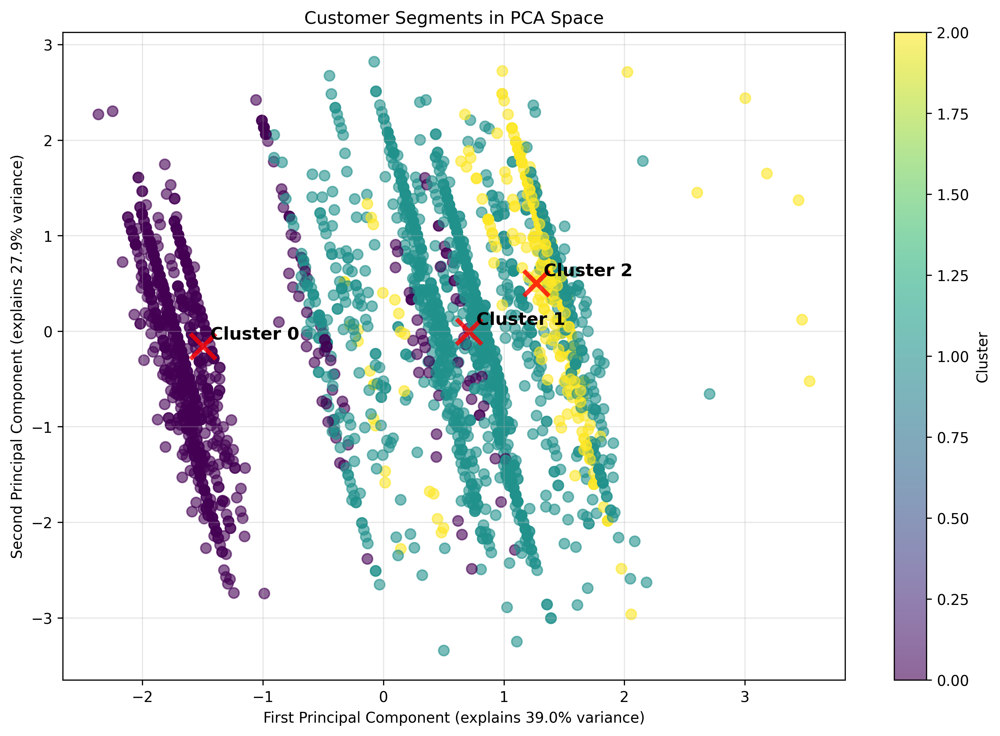

# 📊 EXECUTIVE SUMMARY - PROYEK CUSTOMER SEGMENTATION & BUSINESS STRATEGY

**Tanggal Laporan:** 2 Agustus 2025  
**Status Overall:** 19.4% Complete (6/31 tasks)  
**Fase Saat Ini:** Transisi Phase 1 → Phase 2

---

## 🎯 PENCAPAIAN UTAMA

### ✅ PHASE 1 COMPLETE (100%)
**Customer Segmentation Analysis** - **SELESAI**

### 🎯 3 Segmen Pelanggan yang Tervalidasi

| Segmen | Pangsa | Ukuran | Rata-rata Pembelian | Status Bisnis |
|---------|-------|------|-----------|-----------|
| **🍳 Penggemar Kuliner** | 53,1% | 1.499 | Rp66rb | 🔥 Volume Leader |
| **👨‍👩‍👧‍👦 Orang Tua & Anak** | 35,2% | 993 | Rp36rb | 🌱 Growth Potential |
| **👗 Kreator Fashion** | 11,7% | 330 | Rp113rb | 💎 Premium Market |

---

## 🚀 PHASE 2 ROADMAP

### 📊 MILESTONE OVERVIEW
| Milestone | Tasks | Status | Target Completion |
|-----------|-------|--------|-------------------|
| **Market Opportunity** | 5 | 📋 Ready to Start | 12 Aug 2025 |
| **CLV & Pricing** | 5 | 📋 Planned | 19 Aug 2025 |
| **Customer Journey** | 5 | 📋 Planned | 26 Aug 2025 |
| **Go-to-Market** | 5 | 📋 Planned | 2 Sep 2025 |
| **Business Model** | 5 | 📋 Planned | 6 Sep 2025 |

---

## ⚡ PRIORITAS MINGGU INI (2-9 Agustus)

### 🔥 HIGH PRIORITY TASKS
1. **Product Demand Analysis per Segment** (Due: 5 Aug)
2. **Market Size & Growth Potential** (Due: 6 Aug)
3. **Competitive Landscape Mapping** (Due: 7 Aug)

### 📋 PROJECT HEALTH: **19.4% Complete**
- ✅ **6 tasks completed** (Phase 1)
- 📋 **25 tasks remaining** (Phase 2)
- 🔥 **15 high-priority tasks** ready for assignment
- 📅 **5 tasks due this week**

---

## 📈 Cerita Data Visual

### Gambaran Pasar

*Dashboard lengkap menunjukkan distribusi, demografi, dan pola perilaku*

### Analisis Mendalam per Segmen

#### 🍳 Penggemar Kuliner - Penggerak Pendapatan (53,1%)

- **Profil**: Orang dewasa mapan (rata-rata 34 tahun), penetapan harga standar
- **Peluang**: Segmen terbesar dengan potensi upsell
- **Strategi**: Kemitraan influencer makanan, kursus progresif

#### 👨‍👩‍👧‍👦 Orang Tua & Anak - Volume Play (35,2%)  

- **Profil**: Orang tua yang sadar anggaran (rata-rata 33 tahun)
- **Peluang**: Pertumbuhan komunitas viral, paket keluarga
- **Strategi**: Komunitas parenting, nilai edukatif

#### 👗 Kreator Fashion - Fokus Premium (11,7%)

- **Profil**: Profesional muda (rata-rata 32 tahun), high-value
- **Peluang**: ARPU tertinggi, pengembangan bisnis
- **Strategi**: Jaringan profesional, program eksklusif

### Validasi Machine Learning

*Validasi statistik menunjukkan pemisahan segmen yang jelas (Silhouette Score: 0,359)*

---

## 💡 Tindakan Strategis

### Prioritas Mendesak (30 Hari ke Depan)
1. **Luncurkan kampanye tertarget** untuk Penggemar Kuliner (potensi ROI terbesar)
2. **Kembangkan penawaran premium** untuk Kreator Fashion (ARPU tertinggi)
3. **Buat paket keluarga** untuk Orang Tua & Anak (pertumbuhan viral)

### Area Investasi Kunci
- **Konten Kuliner**: Bermitra dengan influencer makanan, kembangkan perpustakaan resep
- **Layanan Premium**: Mentoring one-on-one, modul bisnis untuk segmen Fashion  
- **Community Building**: Jaringan orang tua, sistem rujukan

### Hasil yang Diharapkan
- **Pertumbuhan Pendapatan**: 25-30% melalui strategi segmen tertarget
- **Akuisisi Pelanggan**: Peningkatan 40% melalui pemasaran terfokus
- **Customer Lifetime Value**: Peningkatan 35% melalui penawaran khusus segmen

---

## 📊 File yang Dihasilkan

**File Analisis:**
- `data_with_clusters.csv` - Dataset lengkap dengan label segmen
- `cluster_summary.csv` - Ringkasan statistik per segmen

**Visualisasi:**
- `customer_segments_overview.png` - Dashboard eksekutif
- `cluster_0_Parents_and_Kids_Segment.png` - Analisis segmen Orang Tua
- `cluster_1_Cooking_Enthusiasts.png` - Analisis segmen Kuliner  
- `cluster_2_Fashion_Creators.png` - Analisis segmen Fashion
- `pca_clusters.png` - Visualisasi validasi ML

**Laporan:**
- `CUSTOMER_SEGMENTATION_REPORT_WITH_VISUALIZATIONS.md` - Laporan teknis lengkap
- `FINAL_REPORT.md` - Laporan strategi bisnis

---

*Analisis selesai: 2 Agustus 2025*  
*Metode: Machine Learning (K-means) + Visualisasi Data*  
*Data: 2.822 record pelanggan*
